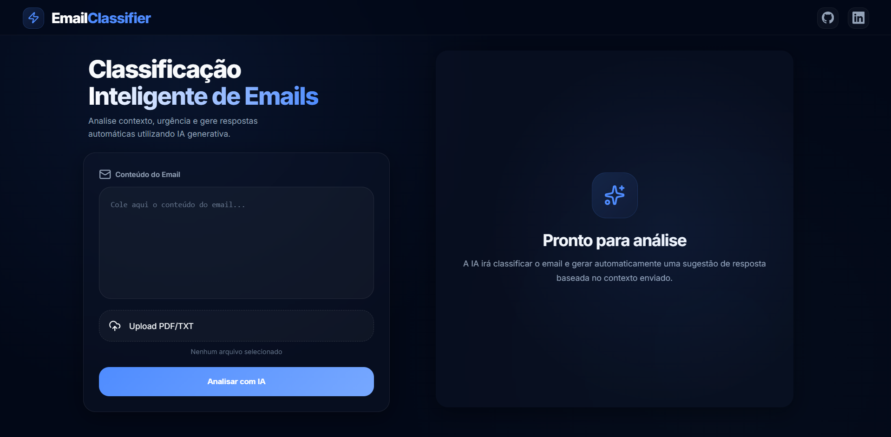
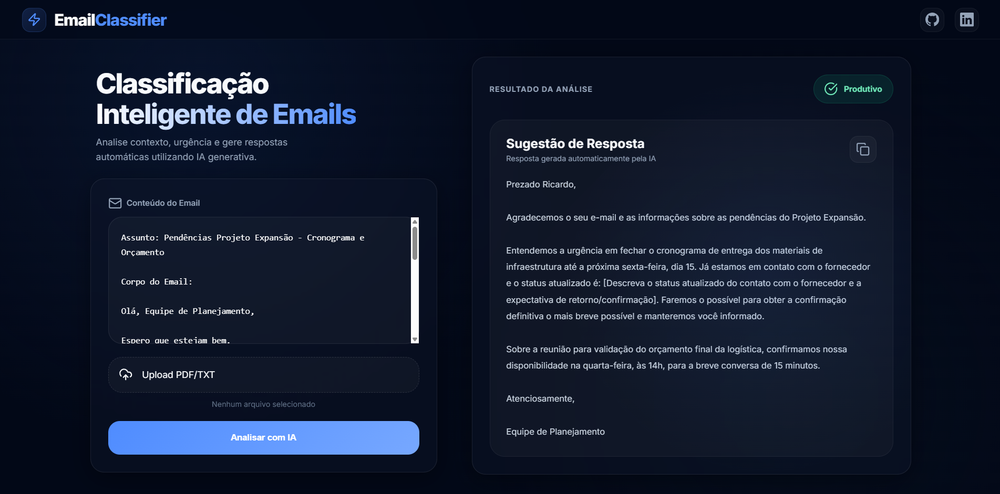

# 📧 AI Email Classifier & Responder

> **Classificação inteligente e respostas automáticas para emails com experiência SaaS Premium e Google Gemini AI.**


## 📖 Sobre o Projeto

O **AI Email Classifier** é uma aplicação web Full Stack de alto nível desenvolvida para transformar o gerenciamento de emails em uma tarefa fluida e inteligente. 

Diferente de ferramentas simples, este projeto foca em **User Experience (UX)**, utilizando uma interface inspirada em plataformas SaaS modernas. O motor é alimentado pelo **Google Gemini 2.5 Flash**, garantindo análises contextuais precisas em milissegundos.

### ✨ Funcionalidades Principais

* **Classificação Inteligente:** Distingue automaticamente entre emails **Produtivos** e **Improdutivos** com base no contexto real da mensagem.
* **Interface Premium (Glassmorphism):** Design sofisticado com efeitos de transparência, desfoque de fundo e tipografia imponente.
* **Layout Side-by-Side:** Grid de duas colunas que permite visualizar a entrada de dados e o resultado da IA simultaneamente, sem necessidade de scroll excessivo.
* **Geração de Respostas Profissionais:** Cria rascunhos de resposta prontos para uso, mantendo o tom de voz executivo.
* **Análise Multimodal de Arquivos:** Suporte para extração e leitura de arquivos `.pdf` e `.txt`.
* **Feedback de Processamento:** Overlay de carregamento integrado para melhorar a percepção de performance durante as chamadas de IA.

---

## 📸 Screenshots

|||
|:---:|:---:|
|**Dashboard Inicial (UI Premium)**|**Análise em Tempo Real**|

---

## 🛠️ Tecnologias Utilizadas

* **Back-end:** Python 3.12, Flask
* **IA / LLM:** Google Gemini API (`google-generativeai`)
* **Front-end:** HTML5, CSS3 (Glassmorphism & CSS Grid), JavaScript (Vanilla)
* **Ícones:** Lucide Icons
* **Manipulação de Arquivos:** PyPDF2
* **Ambiente:** Dotenv para gestão de segredos e chaves de API

---

## 🚀 Como Executar o Projeto

### Pré-requisitos

* Python 3.x instalado.
* Chave de API do Google AI Studio.

### Passo a Passo

1.  **Clone o repositório:**
    ```bash
    git clone https://github.com/MateusLima909/email-classifier.git
    cd email-classifier
    ```

2.  **Ambiente Virtual:**
    ```bash
    python -m venv venv
    # Windows
    venv\Scripts\activate
    # Linux/Mac
    source venv/bin/activate
    ```

3.  **Instalação:**
    ```bash
    pip install -r requirements.txt
    ```

4.  **Variáveis de Ambiente:**
    * Crie um arquivo `.env` na raiz.
    * Adicione sua chave:
        ```env
        GEMINI_API_KEY=sua_chave_aqui
        ```

5.  **Run:**
    ```bash
    python app.py
    ```
    * Acesse: `http://127.0.0.1:5000`

---

## 🗺️ Roadmap de Evolução

- [ ] **Structured Output:** Transição para respostas em JSON para extrair metadados (urgência, sentimento).
- [ ] **Integração com Gmail API:** Leitura direta da caixa de entrada via OAuth2.
- [ ] **Memória de Contexto (RAG):** Banco de vetores para aprender o tom de voz do usuário com base em emails passados.
- [ ] **Persistência de Dados:** Histórico de análises salvo em banco de dados local (SQLite/PostgreSQL).
- [ ] **Deploy:** Hospedagem em nuvem (Render ou Vercel).

---

## 🤝 Contribuição

Sugestões para melhorar a IA ou o design são sempre bem-vindas! Sinta-se à vontade para abrir uma issue.

## 📝 Licença

Desenvolvido por **[Mateus Lima](https://www.linkedin.com/in/mateuslima-santos)**.